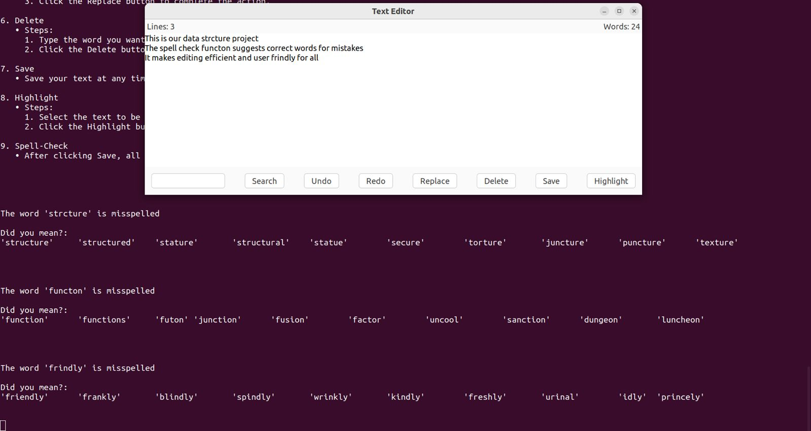

# Text-Editor-with-Spell-Checking
## Overview
A text editor written in C using the GTK interface, featuring spell-checking and word suggestion functionality for easier text editing.
## Functions:
1. Save to File
2. No. of words, lines
3. Undo
4. Redo
5. Spell Checker
6. Suggestions
7. Replace
8. Search
9. Delete
10. Highlight
## Features:
This project is a feature-rich text editor developed in C using the GTK interface, designed to enhance the text-editing experience. With advanced features like real-time word/line count, spell-checking, and word suggestions, the editor offers a comprehensive solution for efficient document management. Key functionalities include undo/redo, search, replace, and highlight, making it a versatile tool for users who need a seamless text-editing workflow.

* Spell Checker: Automatically detects misspelled words and provides suggestions using the Levenshtein Distance algorithm.
* Real-Time Updates: Displays word and line counts in real-time as you type.
* Undo/Redo: Easily revert or reapply changes to the text.
* Word Suggestions: Offers the most relevant word suggestions based on similarity and Levenshtein distance.
* Search/Replace/Delete: Quickly search for, replace, or delete words within the document.
* Highlighting: Allows users to highlight important text for better visibility.

## Technologies Used:
* C Programming: For core text editor functionality.
* GTK: For the graphical interface.
* Levenshtein Distance: For spell-checking and word suggestion generation.
* Data Structures:
  1. Doubly link list
  2. Stack
  3. Hash Table
  4. Trie
  5. Array
  7. Levenshtein Algorithm
  8. File Handling

## Here is an image from our project:

