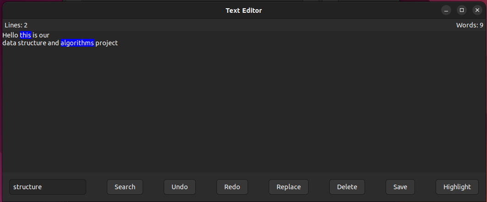

# Text-Editor-with-Spell-Checking
## Overview
A text editor written in C using the GTK interface, featuring spell-checking and word suggestion functionality for easier text editing.
## Features
1. Save to File
2. No. of words, lines
3. Undo
4. Redo
5. Spell Checker
6. Suggestions
7. Replace
8. Search
9. Delete
10. Highlight
## Here is an image from my project:

